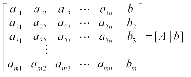

# Gauss Method 

This program implement the gauss method for solving system of linear equations. This is part of an exercise from numerical analysis class.

```
In linear algebra, Gaussian elimination (also known as row reduction) is an algorithm 
for solving systems of linear equations. It is usually understood as a sequence of 
operations performed on the corresponding matrix of coefficients. Using these 
operations, a matrix can always be transformed into an upper triangular matrix, and in 
fact one that is in row echelon form.
```

## How to build and run

Build with make:

```
$ make
```
Run:

```
$ ./gauss-method
```


### Input

One augmented matrix of a linear system

<p align="center">
	
</p>

#### Output

Print the original matrix, the upper triangular matrix equivalent of the original,the type of linear system and one solution for it, if exist. 

## Example


```
$ ./gauss-method 
Quantidade de variaveis: 3
M[1][1]=1
M[1][2]=4
M[1][3]=1
M[1][4]=-3
M[2][1]=2
M[2][2]=-1
M[2][3]=2
M[2][4]=3
M[3][1]=1
M[3][2]=2
M[3][3]=1
M[3][4]=-1

     1.000     4.000     1.000    -3.000
     2.000    -1.000     2.000     3.000
     1.000     2.000     1.000    -1.000
Matriz triangularizada

     1.000     4.000     1.000    -3.000
     0.000    -9.000     0.000     9.000
     0.000     0.000     0.000     0.000
SL DETERMINADO
x[1]=     1.000
x[2]=    -1.000
x[3]=     0.000

```
